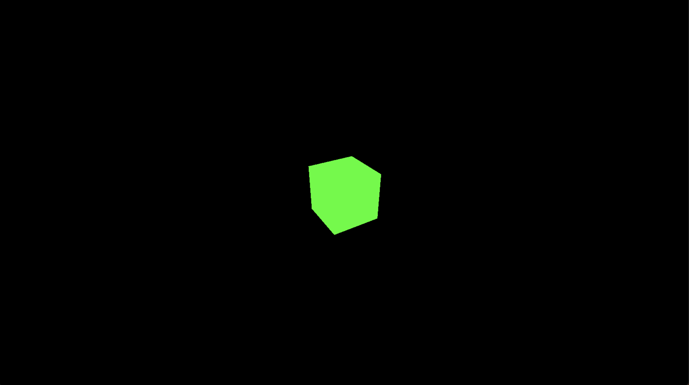

# Lab 1 : Commencer avec Three.js

## Create simple html

```html
<html lang="en">

<head>
    <meta charset="UTF-8" />
    <title>Three.js introduction</title>
    <style>
        body {
            margin: 0;
        }
    </style>
</head>

<body>
    <!--  Our code  -->
    <script type="module" src="main.js"></script>
</body>

</html>
```
> Note: The `type="module"` attribute is important to use ES6 modules.
> Note: The `style` tag is not necessary, it is only used to remove the margin of the body.

## Add threejs
    
```html
<!--  Three.js CDN  -->
<script src="https://cdnjs.cloudflare.com/ajax/libs/three.js/0.159.0/three.min.js"></script>
```
> Note: The version of threejs can be changed, but it is recommended to use the latest version. Find it here: https://cdnjs.com/libraries/three.js/


## Create simple js

- Create scene, the scene is the container of all objects and lights
```js
const scene = new THREE.Scene();
```

- Create camera with FOV, aspect ratio, near and far clipping plane and set position
    - FOV: Field of view, the angle of the camera
    - Aspect ratio: The ratio between the width and the height of the camera
    - Near and far clipping plane: The distance from the camera where objects are rendered
```js
const camera = new THREE.PerspectiveCamera(75, window.innerWidth / window.innerHeight, 0.1, 1000);
camera.position.z = 5;
```

- Create renderer, set the size, and add it to the body. The renderer is the object that renders the scene, it can be a WebGL renderer or a canvas renderer. In this case we use a WebGL renderer.
```js
const renderer = new THREE.WebGLRenderer();
renderer.setSize(window.innerWidth, window.innerHeight);
document.body.appendChild(renderer.domElement);
```

- Create geometry, in this case a cube. There are many geometries, find them here under the Geometries section: https://threejs.org/docs/index.html#api/en/geometries/BoxGeometry
```js
const geometry = new THREE.BoxGeometry();
```

- Create material, in this case a basic material with a green color. There are many materials, find them here under the Materials section: https://threejs.org/docs/index.html#api/en/materials/MeshBasicMaterial
```js
const material = new THREE.MeshBasicMaterial({
    color: 0x00ff00
});
```

- Create cube by adding the geometry and the material, and add it to the scene
```js
const cube = new THREE.Mesh(geometry, material);
scene.add(cube);
```

- Render the scene. The `animate` function is called in a loop to render the scene at each frame.
    - `requestAnimationFrame` is a function that calls the `animate` function at each frame
    - `renderer.render` renders the scene with the camera

```js
function animate() {
    requestAnimationFrame(animate);
    renderer.render(scene, camera);
}
animate();
```

- Add cube rotation in the animation, the `cube.rotation` is an object with the `x`, `y` and `z` properties. The rotation is in radians, so we add 0.01 radians at each frame. The degres to radians conversion is `radians = degres * Math.PI / 180`.

```js
function animate() {
    requestAnimationFrame(animate);
    cube.rotation.x += 0.01;
    cube.rotation.y += 0.01;
    renderer.render(scene, camera);
}
```

## Final code
- `index.html`
```html
<html lang="en">

<head>
    <meta charset="UTF-8" />
    <title>Three.js introduction</title>
    <style>
        body {
            margin: 0;
        }
    </style>
    <!--  Three.js CDN  -->
    <script src="https://cdnjs.cloudflare.com/ajax/libs/three.js/0.159.0/three.min.js"></script>
</head>

<body>
    <!--  Our code  -->
    <script type="module" src="main.js"></script>
</body>

</html>
```

- `main.js`
```js

// Create scene, camera and renderer
const scene = new THREE.Scene();
const camera = new THREE.PerspectiveCamera(75, window.innerWidth / window.innerHeight, 0.1, 1000);
const renderer = new THREE.WebGLRenderer();
renderer.setSize(window.innerWidth, window.innerHeight);
document.body.appendChild(renderer.domElement);

// Create cube
const geometry = new THREE.BoxGeometry();
const material = new THREE.MeshBasicMaterial({ color: 0x00ff00 });
const cube = new THREE.Mesh(geometry, material);
scene.add(cube);

// Set camera position
camera.position.z = 5;

// Animate scene
const animate = () => {
    requestAnimationFrame(animate);

    // Rotation du cube
    cube.rotation.x += 0.01;
    cube.rotation.y += 0.01;

    renderer.render(scene, camera);
}
animate();
```

## Result
