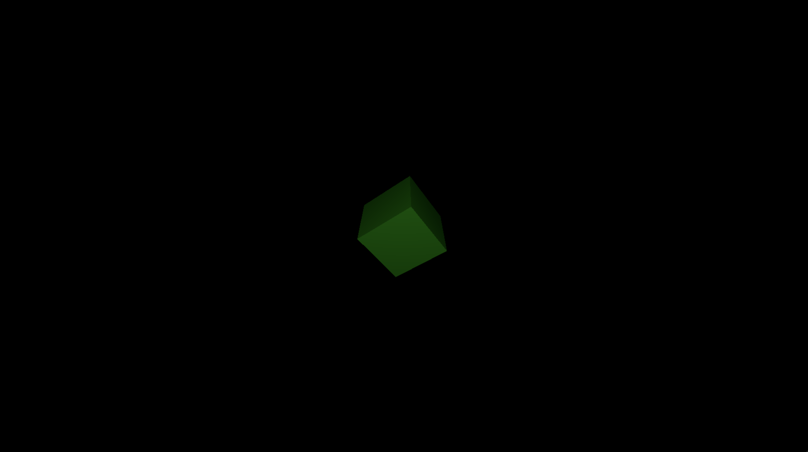

# Lab 2 : Shader et textures
- Change material of the cube from `MeshBasicMaterial` to `MeshPhongMaterial`

**OLD Value**
```js
const material = new THREE.MeshBasicMaterial({
    color: 0x00ff00
});
```

**NEW Value**
```js
const material = new THREE.MeshPhongMaterial({
    color: 0x00ff00
});
```

- Add a light to the scene to see the cube
    - Create a `PointLight` with white color, intensity 1 and distance 100
    - Set the position of the light to (0, 0, 10)
    - Add the light to the scene
```js
const light = new THREE.PointLight(0xffffff, 5, 100);
light.position.set(0, 0, 10);
scene.add(light);
```

## Final code
- `index.html`
```html
<html lang="en">

<head>
    <meta charset="UTF-8" />
    <title>Three.js introduction</title>
    <style>
        body {
            margin: 0;
        }
    </style>
    <!--  Three.js CDN  -->
    <script src="https://cdnjs.cloudflare.com/ajax/libs/three.js/0.159.0/three.min.js"></script>
</head>

<body>
    <!--  Our code  -->
    <script type="module" src="main.js"></script>
</body>

</html>
```

- `main.js`
```js

// Create scene
const scene = new THREE.Scene();

// Create camera and set position
const camera = new THREE.PerspectiveCamera(75, window.innerWidth / window.innerHeight, 0.1, 1000);
camera.position.z = 5;

// Create renderer and set size, then add it to the DOM
const renderer = new THREE.WebGLRenderer();
renderer.setSize(window.innerWidth, window.innerHeight);
document.body.appendChild(renderer.domElement);

// Create cube
const geometry = new THREE.BoxGeometry();
const material = new THREE.MeshPhongMaterial({ color: 0x00ff00 });
const cube = new THREE.Mesh(geometry, material);
scene.add(cube);

// Create light, set position and add it to the scene
const light = new THREE.PointLight(0xffffff, 5, 100);
light.position.set(0, 0, 5);
scene.add(light);

// Animate scene
const animate = () => {
    requestAnimationFrame(animate);

    // Rotation du cube
    cube.rotation.x += 0.01;
    cube.rotation.y += 0.01;

    renderer.render(scene, camera);
}
animate();
```

## Result
