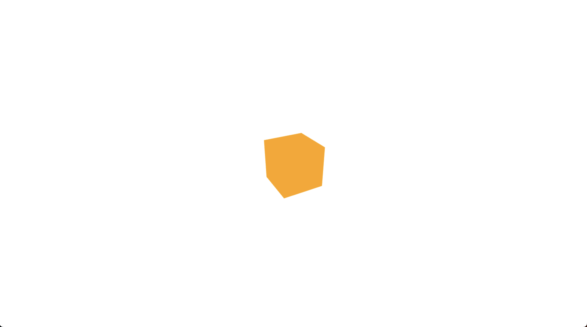

# Première scène
Dans ce premier lab, nous allons créer une scène 3D simple avec un cube qui tournant. Nous allons faire les étapes suivantes:
- **[Etape 1: Créer `index.html`](#étape-1-créer-indexhtml) :** C'est le fichier HTML qui chargera threejs et notre code.
- **[Etape 2: Créer `main.js`](#étape-2-créer-mainjs) :** C'est le fichier qui contiendra notre code.
- **[Etape 3: Créer une scène vide](#étape-3-créer-une-scène-vide) :** Nous allons créer une scène vide avec un fond blanc.
- **[Etape 4: Créer une caméra](#étape-4-créer-une-caméra) :** Nous allons créer une caméra pour voir la scène.
- **[Etape 5: Créer un rendu](#étape-5-créer-un-rendu) :** Nous allons créer un rendu pour afficher la scène.
- **[Etape 6: Créer un cube](#étape-6-créer-un-cube) :** Nous allons créer un cube et l'ajouter à la scène.
- **[Etape 7: Ajouter la lumière](#étape-7-ajouter-la-lumière) :** Nous allons ajouter une lumière à la scène.
- **[Etape 8: Créer une fonction d'animation](#étape-8-créer-une-fonction-danimation) :** Nous allons créer une fonction d'animation pour faire tourner le cube.
- **[Etape 9: Exécuter le code](#étape-9-exécuter-le-code) :** Nous allons exécuter le code et voir le résultat.

Vous pouvez voir le code en entier [ici](#code-complet). et voir le résulta de la scène [ici](#result).

# Etapes
## Étape 1: Créer `index.html`
Créez un fichier `index.html` et ajoutez le code suivant:
```html
<html lang="en">

<head>
    <meta charset="UTF-8" />
    <title>Votre première scène</title>
    <style>
        body {
            margin: 0;
        }
        
        canvas {
            width: 100%;
            height: 100%
        }
    </style>
    <script type="importmap">
        { "imports": { "three": "https://unpkg.com/three@0.159.0/build/three.module.js", "three/addons/": "https://unpkg.com/three@0.159.0/examples/jsm/" } }
    </script>
</head>

<body>
    <script type="module" src="main.js"></script>
</body>

</html>
```
- `type="importmap"` est utilisé pour importer des modules. nous utilisons `unpkg` pour importer threejs et ses modules.
- `type="module"` est utilisé pour importer le module `main.js` qui contient le code.

## Étape 2: Créer `main.js`
Créez un fichier `main.js`, laisser vide pour le moment.

## Étape 3: Créer une scène vide
Dans `main.js`, ajoutez le code suivant:
```js
import * as THREE from 'three';

const scene = new THREE.Scene();
scene.background = new THREE.Color(0xffffff);
```
- `import * as THREE from 'three'` importe le module `three` et le stocke dans la variable `THREE`.
- `new THREE.Scene()` crée une nouvelle scène vide.
- `scene.background = new THREE.Color(0xffffff)` définit la couleur de fond de la scène en blanc.

## Étape 4: Créer une caméra
Dans `main.js`, ajoutez le code suivant:
```js
  const fov = 75;
  const aspect = window.innerWidth / window.innerHeight;
  const near = 0.1;
  const far = 1000;
  camera = new THREE.PerspectiveCamera(fov, aspect, near, far);
  camera.position.z = 5;
```
- `fov` est le champ de vision de la caméra. Il s'agit de l'angle de vue de la caméra.
- `aspect` est le rapport largeur / hauteur de la caméra. Nous utilisons la largeur et la hauteur de la fenêtre pour cela.
- `near` et `far` sont les distances de la caméra à la scène. Les objets plus proches que `near` ou plus éloignés que `far` ne seront pas rendus.
- `new THREE.PerspectiveCamera(fov, aspect, near, far)` crée une nouvelle caméra avec les paramètres spécifiés. le PerspectiveCamera est utilisé pour la perspective 3D. Il existe également une caméra orthographique pour la projection orthographique.
- `camera.position.z = 5` définit la position de la caméra à 5 unités sur l'axe z. Cela permet de voir le cube.

## Étape 5: Créer un rendu
Dans `main.js`, ajoutez le code suivant:
```js
  renderer = new THREE.WebGLRenderer({ antialias: true });
  renderer.setSize(window.innerWidth, window.innerHeight);
  document.body.appendChild(renderer.domElement);
```
- `new THREE.WebGLRenderer({ antialias: true })` crée un nouveau rendu WebGL avec l'anti-crénelage activé. L'anti-crénelage est une technique pour rendre les bords des objets plus lisses. Cela rendra le rendu plus lent, mais il est recommandé de l'activer.
- `renderer.setSize(window.innerWidth, window.innerHeight)` définit la taille du rendu sur la taille de la fenêtre.
- `document.body.appendChild(renderer.domElement)` ajoute le rendu à la page.

## Étape 6: Créer un cube
Dans `main.js`, ajoutez le code suivant:
```js
  const geometry = new THREE.BoxGeometry();
  const material = new THREE.MeshBasicMaterial({ color: 0xffa500 });
  cube = new THREE.Mesh(geometry, material);
  scene.add(cube);
```
- `new THREE.BoxGeometry()` crée une nouvelle géométrie de cube de type `BoxGeometry`. Il existe de nombreux autres types de géométrie, par exemple `SphereGeometry` ou `ConeGeometry`.
- `new THREE.MeshBasicMaterial({ color: 0xffa500 })` crée un nouveau matériau de base de type `MeshBasicMaterial` en lui donnant une couleur orange. Il existe de nombreux autres types de matériaux, par exemple `MeshPhongMaterial` ou `MeshStandardMaterial`. La liste complète des matériaux peut être trouvée [ici](https://threejs.org/docs/#api/en/materials/Material).
- `new THREE.Mesh(geometry, material)` crée un nouveau maillage en utilisant la géométrie et le matériau spécifiés.
- `scene.add(cube)` ajoute le cube à la scène.

## Étape 7: Ajouter la lumière
Dans `main.js`, ajoutez le code suivant pour le AmbiantLight:
```js
  const color = 0xffffff;
  const intensity = 1;
  const light = new THREE.AmbientLight(color, intensity);
  scene.add(light);
```
- `new THREE.AmbientLight(color, intensity)` crée une nouvelle lumière ambiante avec la couleur et l'intensité spécifiées. Il existe de nombreux autres types de lumières, par exemple `DirectionalLight` ou `PointLight`. La liste complète des lumières peut être trouvée [ici](https://threejs.org/docs/#api/en/lights/Light).

## Étape 8: Créer une fonction d'animation
Dans `main.js`, ajoutez le code suivant:
```js
  const animate = () => {
    requestAnimationFrame(animate);

    cube.rotation.x += 0.01;
    cube.rotation.y += 0.01;
    
    renderer.render(scene, camera);
  }
  animate();
```

## Étape 9: Exécuter le code
Ouvrez `index.html` dans votre navigateur et vous devriez voir un cube orange tournant sur un fond blanc.

# Code complet
## `index.html`
```html
<html lang="en">

<head>
    <meta charset="UTF-8" />
    <title>Votre première scène</title>
    <style>
        body {
            margin: 0;
        }
        
        canvas {
            width: 100%;
            height: 100%
        }
    </style>
    <script type="importmap">
        { "imports": { "three": "https://unpkg.com/three@0.159.0/build/three.module.js", "three/addons/": "https://unpkg.com/three@0.159.0/examples/jsm/" } }
    </script>
</head>

<body>
    <!--  Our code  -->
    <script type="module" src="main.js"></script>
</body>

</html>
```

## `main.js`
```js
import * as THREE from "three";

let scene, camera, renderer, cube;

function init() {
  // Création de la scène
  scene = new THREE.Scene();
  scene.background = new THREE.Color(0xffffff);

  // Create the camera and set its position
  const fov = 75; // Field of view, in degrees.
  const aspect = window.innerWidth / window.innerHeight; // Aspect ratio
  const near = 0.1; // Near clipping plane
  const far = 1000; // Far clipping plane
  camera = new THREE.PerspectiveCamera(fov, aspect, near, far);
  camera.position.z = 5;

  // Création du rendu
  renderer = new THREE.WebGLRenderer({ antialias: true });
  renderer.setSize(window.innerWidth, window.innerHeight);
  document.body.appendChild(renderer.domElement);

  // Create a cube and add it to the scene
  const geometry = new THREE.BoxGeometry();
  const material = new THREE.MeshBasicMaterial({ color: 0xffa500 });
  cube = new THREE.Mesh(geometry, material);
  scene.add(cube);

  // Ajout de lumières
  const color = 0xffffff;
  const intensity = 1;
  let hlight = new THREE.AmbientLight(color, intensity);
  scene.add(hlight);

  // Démarrage de l'animation
  animate();
}

function animate() {
  requestAnimationFrame(animate);
  cube.rotation.x += 0.01;
  cube.rotation.y += 0.01;
  renderer.render(scene, camera);
}

init();
```

# Result
