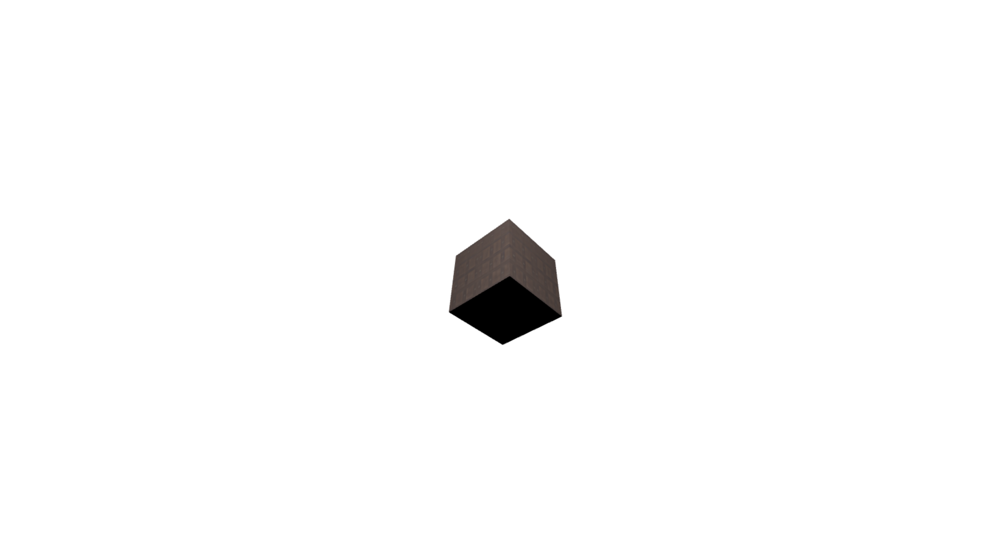

# Ajouter de la texture
Dans cette étape, nous allons ajouter de la texture au cube. la textre que nous allons utiliser est une image de bois. Nous allons faire les étapes suivantes:

- **[Etape 1: Préparer la scène](#étape-1-préparer-la-scène) :** Nous allons préparer la scène pour ajouter la texture.
- **[Etape 2: Créer une texture](#étape-2-créer-une-texture) :** Nous allons créer une texture à partir de l'image de bois.
- **[Etape 3: Appliquer la texture au cube](#étape-3-appliquer-la-texture-au-cube) :** Nous allons appliquer la texture au cube.
- **[Etape 4: Changer le type de lumière](#étape-4-changer-le-type-de-lumière) :** Nous allons changer le type de lumière.
- **[Etape 5: Exécuter le code](#étape-5-exécuter-le-code) :** Nous allons exécuter le code et voir le résultat.

Vous pouvez voir le code en entier [ici](#code-complet). et voir le résulta de la scène [ici](#result).

## Étape 1: Préparer la scène
Nous commencer par le code résultat de l'étape précédente.
- [`index.html`](../lab1/README.md#indexhtml)
- [`main.js`](../lab1/README.md#mainjs)

## Étape 2: Créer une texture
Ajoutez le code suivant à la fin de `main.js`:
```js
const loader = new THREE.TextureLoader();
const texture = loader.load('wood.jpg');
```
- `TextureLoader` est utilisé pour charger une image et la convertir en texture. Il prend le chemin de l'image en paramètre. il y a d'autres types de textures, vous pouvez les voir [ici](https://threejs.org/docs/#api/en/loaders/TextureLoader).
- `const texture = loader.load('wood.jpg')` charge l'image `wood.jpg` et la convertit en texture

## Étape 3: Appliquer la texture au cube
Ajoutez le code suivant à la fin de `main.js`:
```js
const geometry = new THREE.BoxGeometry(1, 1, 1);
const material = new THREE.MeshBasicMaterial({ map: texture });
const cube = new THREE.Mesh(geometry, material);
scene.add(cube);
```

## Étape 4 : Changer le type de lumière
Dans cette étape, nous allons changer le type de lumière. Nous allons utilisé le `PointLight` qui émet de la lumière dans toutes les directions à partir d'un point.
```js
const light = new THREE.PointLight(0xeeeeee, 50);
light.position.set(0, 4, 4);
scene.add(light);
```
- `PointLight` prend deux paramètres:
  - `color` : La couleur de la lumière.
  - `intensity` : L'intensité de la lumière.
- `light.position.set(0, 4, 4)` définit la position de la lumière.

## Étape 5 : Exécuter le code
Ouvrez `index.html` dans votre navigateur et vous devriez voir un cube avec une texture de bois et une lumière.

# Code complet
## `index.html`
```html
<html lang="en">

<head>
    <meta charset="UTF-8" />
    <title>Ajouter de la texture</title>
    <style>
        body {
            margin: 0;
        }
        
        canvas {
            width: 100%;
            height: 100%
        }
    </style>
    <script type="importmap">
        { "imports": { "three": "https://unpkg.com/three@0.159.0/build/three.module.js", "three/addons/": "https://unpkg.com/three@0.159.0/examples/jsm/" } }
    </script>
</head>

<body>
    <!--  Our code  -->
    <script type="module" src="main.js"></script>
</body>

</html>
```

## `main.js`
```js
import * as THREE from "three";

let scene, camera, renderer, cube;

const init = () => {
  // Création de la scène
  scene = new THREE.Scene();
  scene.background = new THREE.Color(0xffffff);

  // Create the camera and set its position
  const fov = 75; // Field of view, in degrees.
  const aspect = window.innerWidth / window.innerHeight; // Aspect ratio
  const near = 0.1; // Near clipping plane
  const far = 1000; // Far clipping plane
  camera = new THREE.PerspectiveCamera(fov, aspect, near, far);
  camera.position.z = 5;

  // Création du rendu
  renderer = new THREE.WebGLRenderer({ antialias: true });
  renderer.setSize(window.innerWidth, window.innerHeight);
  document.body.appendChild(renderer.domElement);

  // Create a cube and add it to the scene
  const geometry = new THREE.BoxGeometry();
  const texture = new THREE.TextureLoader().load("wood.jpg");
  const material = new THREE.MeshPhongMaterial({ map: texture });
  cube = new THREE.Mesh(geometry, material);
  scene.add(cube);

// Create a light and add it to the scene
const light = new THREE.PointLight(0xeeeeee, 50);
light.position.set(0, 4, 4);
scene.add(light);

  // Démarrage de l'animation
  animate();
};

// Loop for animation
const animate = () => {
  requestAnimationFrame(animate);

  // Rotate the cube
  cube.rotation.x += 0.01;
  cube.rotation.y += 0.01;

  renderer.render(scene, camera);
};

init();
```

# Result
