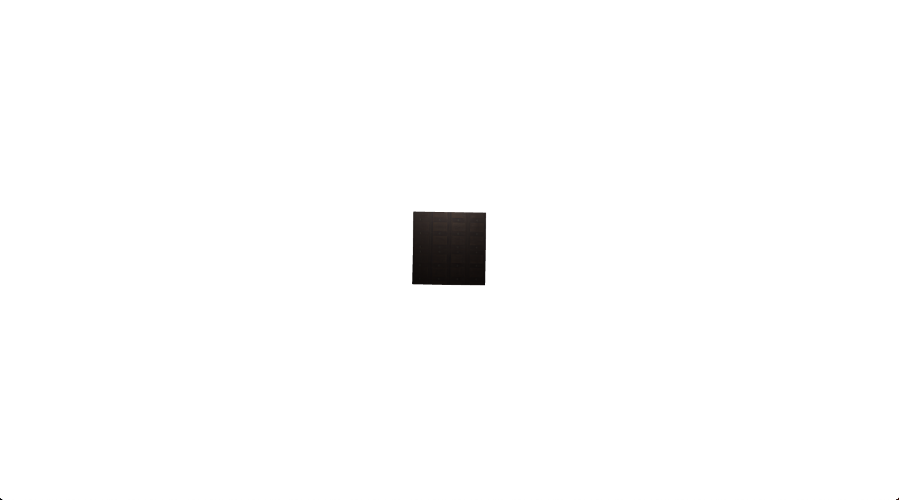

# Lumière ponctuelle
La lumière ponctuelle émet de la lumière dans toutes les directions à partir d'un point. Elle est utile pour simuler des lampes et des bougies.

## Étape 1: Préparer la scène
Nous commencer par le code résultat de l'étape précédente.
- [`index.html`](../lab1/README.md#indexhtml)
- [`main.js`](../lab1/README.md#mainjs)

## Étape 2: Ajouter une lumière ponctuelle
```js
// Création d'une lumière ponctuelle
const pointLight = new THREE.PointLight(0xffffff, 1, 100);
pointLight.position.set(10, 10, 10);
scene.add(pointLight);
```
- `THREE.PointLight` prend trois paramètres:
  - `color` : La couleur de la lumière.
  - `intensity` : L'intensité de la lumière.
  - `distance` : La distance à laquelle la lumière commence à diminuer.
- `pointLight.position.set(10, 10, 10)` définit la position de la lumière.

## Étape 3: Exécuter le code
Ouvrez `index.html` dans votre navigateur et vous devriez voir un cube avec une texture de bois et une lumière ponctuelle.

# Code complet
## `index.html`
```html
<html lang="en">

<head>
    <meta charset="UTF-8" />
    <title>Ajouter de la texture</title>
    <style>
        body {
            margin: 0;
        }
        
        canvas {
            width: 100%;
            height: 100%
        }
    </style>
    <script type="importmap">
        { "imports": { "three": "https://unpkg.com/three@0.159.0/build/three.module.js", "three/addons/": "https://unpkg.com/three@0.159.0/examples/jsm/" } }
    </script>
</head>

<body>
    <!--  Our code  -->
    <script type="module" src="main.js"></script>
</body>

</html>
```

## `main.js`
```js
import * as THREE from "three";

let scene, camera, renderer, cube;

const init = () => {
  // Création de la scène
  scene = new THREE.Scene();
  scene.background = new THREE.Color(0xffffff);

  // Create the camera and set its position
  const fov = 75; // Field of view, in degrees.
  const aspect = window.innerWidth / window.innerHeight; // Aspect ratio
  const near = 0.1; // Near clipping plane
  const far = 1000; // Far clipping plane
  camera = new THREE.PerspectiveCamera(fov, aspect, near, far);
  camera.position.z = 5;

  // Création du rendu
  renderer = new THREE.WebGLRenderer({ antialias: true });
  renderer.setSize(window.innerWidth, window.innerHeight);
  document.body.appendChild(renderer.domElement);

  // Create a cube and add it to the scene
  const geometry = new THREE.BoxGeometry();
  const texture = new THREE.TextureLoader().load("../wood.jpg");
  const material = new THREE.MeshPhongMaterial({ map: texture });
  cube = new THREE.Mesh(geometry, material);
  scene.add(cube);

  // Création d'une lumière ambiante
  const color = 0xeeeeee;
  const intensity = 0.5;
  const pointLight = new THREE.PointLight(color, intensity, 100);
  pointLight.position.set(0, 1, 1);
  scene.add(pointLight);

  // Démarrage de l'animation
  animate();
};

// Loop for animation
const animate = () => {
  requestAnimationFrame(animate);

  // Rotate the cube
  cube.rotation.x += 0.01;
  cube.rotation.y += 0.01;

  renderer.render(scene, camera);
};

init();
```

# Result

  